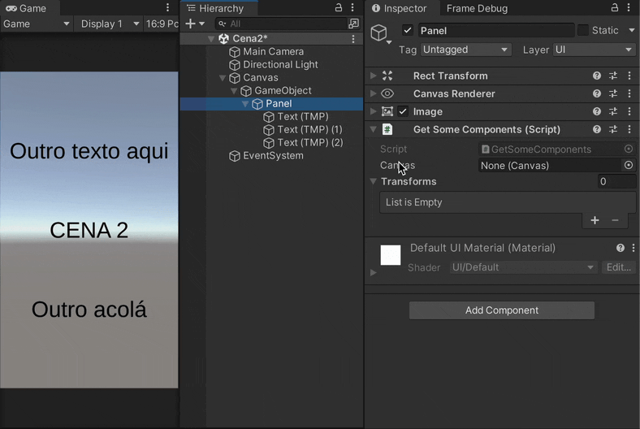

# GetComponent Context Menu
Context menu items for setting up Component references based on `GetComponent(s)`, `GetComponent(s)InChildren`, `GetComponent(s)InParent` and `FindObject(s)OfType` methods.




## How to install
Either:

- Install via [Unity Package Manager](https://docs.unity3d.com/Manual/upm-ui-giturl.html) using the following URL:
  ```
  https://https://github.com/gilzoide/unity-get-component-context-menu.git#1.0.0
  ```

- Copy the script [GetComponentContextMenu.cs](Editor/GetComponentContextMenu.cs) directly into your project inside any `Editor` folder